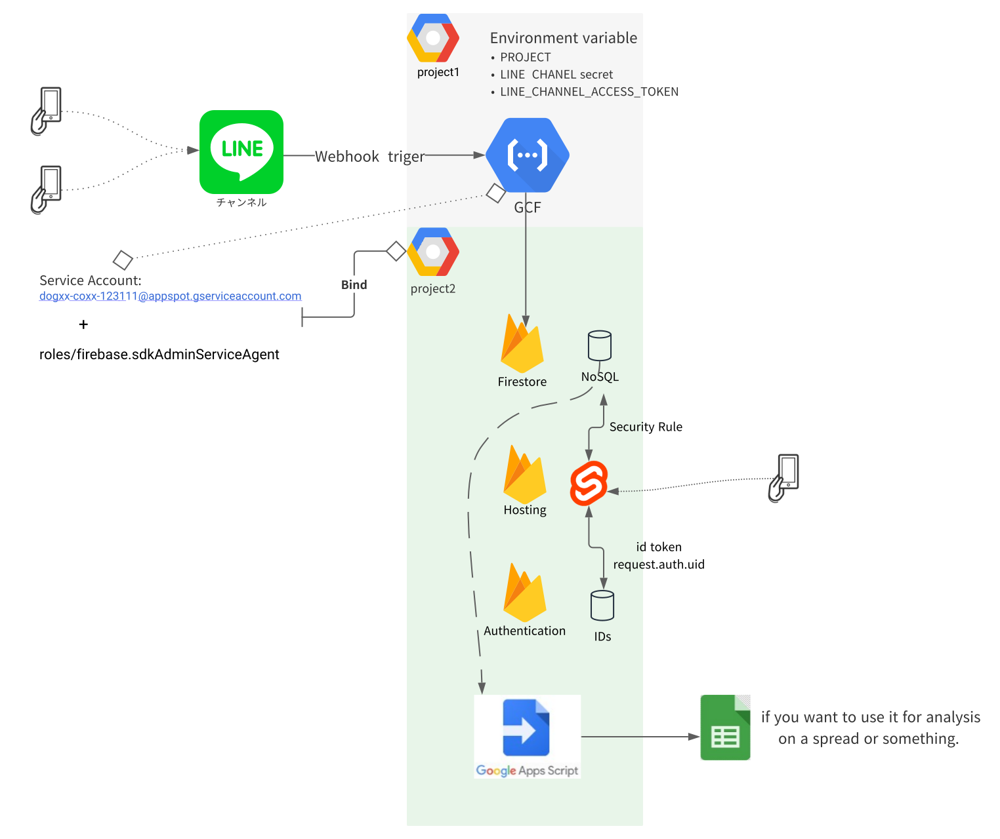

# Overview



# environment 
<details><summary>(If you clone, you don't need to do anything but install poetry.)</summary><div>

```sh
sudo pip install poetry
poetry -V
poetry config --list
poetry new gcf_to_firestore
poetry add google-cloud-firestore
poetry add fire
poetry add firebase-admin
poetry add functions-framework
poetry add line-bot-sdk
poetry env info #仮想環境の情報
```
</div>
</details>

# install packages
```sh
cd gcf_to_firestore
# For backend by python
poetry install
portry run gcf_to_firestore/xxx.py
# Remove env (if necessary)
poetry env remove {envname-e9GtqrbW-py3.7}

# Sevelt
#npm i  #and so on..
```

# Access to Firestore from backend(Use Firestore admin sdk for python)

## Setting IAM role/service account（Production)
* Firestoreのproject側で、roles/firebase.sdkAdminServiceAgent(Firebase Admin SDK 管理者サービス エージェント)ロールを紐付けるサービスアカウントをbindしておくことでFunctions(サービスアカウント)から（外部の）Firestoreへアクセスができる。
*  `db = firestore.Client(project={'pj_id'})` な感じで指定しないとFunctions自身のprojectを見に行ってしまうのでデプロイ時には必ず指定してあげる.(ハードコードで問題ない)
Overviewの図を見ながらだと分かりやすいよ。

## Download Service accrount key（Local）
※（GCFの環境ではservice accountを紐付けてやれば良いので`localで試す場合等以外`は以下を行う必要は無い）   
基本WebConsoleからDL。
https://console.firebase.google.com/u/0/project/{Project_name}/settings/serviceaccounts/adminsdk   

gcloudからもできるかも。

## Setting environment variable（local）
```sh
export PROJECT="YOUR_PROJECT_ID" #Not number
export GOOGLE_APPLICATION_CREDENTIALS="[PATH]" 
```
環境変数 FIREBASE_CONFIG に、PrivateKeyのJSONをそのままいれるを入れる方法もあります。CI環境でAdmin SDKを利用するような場合に有用そう。   
https://firebase.google.com/docs/admin/setup?authuser=0#initialize-without-parameters
```sh
#たぶんこんな感じ。試してない。(サービスアカウント紐づけておけば、これは無くてもよい)
key=$(base64 ~/Download/xx.json)
export FIREBASE_CONFIG="$key"
```


## Degug in Local emulator(Functions-framework)
linebotからのinputからの確認する場合はそれなりのデータ構造で送信する必要ありそうなのでその場合は[要調査](https://developers.line.biz/ja/reference/messaging-api/#webhook-event-objects))
```sh
# localにWebサーバ起動。(Flask) --targetは関数名。
functions-framework --target=_hello_debug --source gcf_to_firestore/main.py --debug
# デフォルト main.py を見るぽいので prd環境ではファイル指定はいらない
functions-framework --target=fujiko3 --debug

# curlとかでテストしたり
curl localhost:8080 -X POST -d 'food 77 supermarket'
```

# Command line usage for local(python-fire)

## Read collection to Firestore by local
```sh
poetry shell
./main.py read {collection}
# help
./main.py read -h
./main.py
```
## Add Document
```sh
./main.py add --collection=Expenses --type='food' --cost=100 --comment='コメント' --user_id='test太郎'
```

## Delete document and collection(documents)
```sh
# Delete document
./main.py Delete doc --doc_id=Cv5uOScv7uV7nsF9zrtm
# Delete collections(danger)
./main.py Delete all Expenses
```

## Summarize by month
```
./main.py sum_handler --value=2021/11
```

## List by month
```
./main.py ls_handler --value=2021/11
```


# Deploying Cloud Functions
refere to https://lonesec.com/2020/09/12/deploy_to_functions_with_agraffe/   
More detail...  https://scrapbox.io/techtechtech/Cloud_Function

## Create requirements.txt
```
$ poetry export --without-hashes -o gcf_to_firestore/requirements.txt
```

## Setting Service account to function.
下記　`gcloud functions deploy ...`を参照

## Deploy to Cloud functions
.gcloudignore を書いとくと不必要なものをuploadしなくて良い。
実行するディレクトリ内のファイルがアップロードされる。
```sh
#コード修正に伴うデプロイは以下のパラメタのみで問題ない。関数名と場所を指定。ファイルはmain.pyじゃないと受け付けてくれない挙動
gcloud functions deploy fujiko3 --source gcf_to_firestore
`main.py`の関数名を指定する必要あり。yamlに書いて指定した方がセキュア ``
```
```sh
#最初の関数作成時は環境変数や諸々のパラメタを設定してあげる必要あり(GUIからでもOK)
gcloud functions deploy fujiko3 --trigger-http \
--env-vars-file=./.env.yaml \
--region us-central1 \
--service-account={対象リソースのFirestoreにアクセスできる権限がbindされたアカウント} \
--source gcf_to_firestore
# Service account を関数に紐付ける場合は、多分deploy時に --service-accountつけてあげれば行けそう
#--set-env-vars LINE_CHANNEL_SECRET=xx,LINE_CHANNEL_ACCESS_TOKEN=xx,PROJECT=xx \
# 上記だと履歴にtoken表示されちゃうので--env-vars-file でファイル経由で渡すのが推奨。
```
<details><summary>その他たくさんのオプションがある</summary><div>

```sh
gcloud functions deploy -h
Usage: gcloud functions deploy (NAME : --region=REGION) [optional flags]
  optional flags may be  --allow-unauthenticated | --build-env-vars-file |
                         --clear-build-env-vars | --clear-env-vars |
                         --clear-labels | --clear-max-instances |
                         --clear-vpc-connector | --egress-settings |
                         --entry-point | --env-vars-file | --help |
                         --ignore-file | --ingress-settings | --max-instances |
                         --memory | --region | --remove-build-env-vars |
                         --remove-env-vars | --remove-labels | --retry |
                         --runtime | --security-level | --service-account |
                         --set-build-env-vars | --set-env-vars | --source |
                         --stage-bucket | --timeout | --trigger-bucket |
                         --trigger-event | --trigger-http | --trigger-resource |
                         --trigger-topic | --update-build-env-vars |
                         --update-env-vars | --update-labels | --vpc-connector
```
</div>
</details>
(In AWS)因みにboto3では以下の変数名で登録しておけば読み込んでくれる。
>AWS_SECRET_ACCESS_KEY   
>AWS_ACCESS_KEY_ID


# Access to Firestore by frontend(Firestore clientSDK from Svelte)
```sh
npm run dev ？
#Todo...
```

# Firebase Local Emulator Suite
https://firebase.google.com/docs/emulator-suite   

### security rule方針
* 基本アクセスできるのはログインしてる人で、ユーザは新規登録させない。
* カスタムclaimでadminできるロールを付けて確認するとかも試す

# Setting LINE bot
reference：  
https://github.com/line/line-bot-sdk-python  
https://medium.com/eureka-engineering/cloud-functions-golang-line-bot-455ab556d0cf  
https://qiita.com/spre55/items/da2ded18ac4652abb936

## Prerequirements
1. 事前にline側でbot(Messageing API)を作成しとく。
```
https://developers.line.biz/console/channel/{channel_id}/messaging-api
https://manager.line.biz/account/{bot basic id}/setting/messaging-api
```
参考：https://qiita.com/K2_Fujita/items/db6db995847f727237ab

2. botサーバ(GCF)のURLを「Webhook URL」にLinebotからPOSTさせるエンドポイントを設定しとく。
 こんな感じのやつ `https://us-central1-{project}.cloudfunctions.net/func_name`
3. QRコードとかからbotを友だち追加しとく。

## Setting for Cloud Functions
「実行する関数」は`main.py`の中にある任意の関数で良い。

### Directory 構造
pip install しないといけないものを`requirements.txt`に記載する。
```
tree
.
├── Pipfile
├── main.py
├── readme.md
└── requirements.txt
```
ref: https://cloud.google.com/functions/docs/writing#functions-writing-file-structuring-python


### Setting Enviroment variable
https://developers.line.biz/console/channel/0000000000/basics を確認し、

`Channel SecretをLINE_CHANNEL_SECRET`として
`AccessTokenをLINE_CHANNEL_ACCESS_TOKEN`として設定する。

`Deploy to Cloud functions`の項を参照

# Setting Firebase
Todo..
